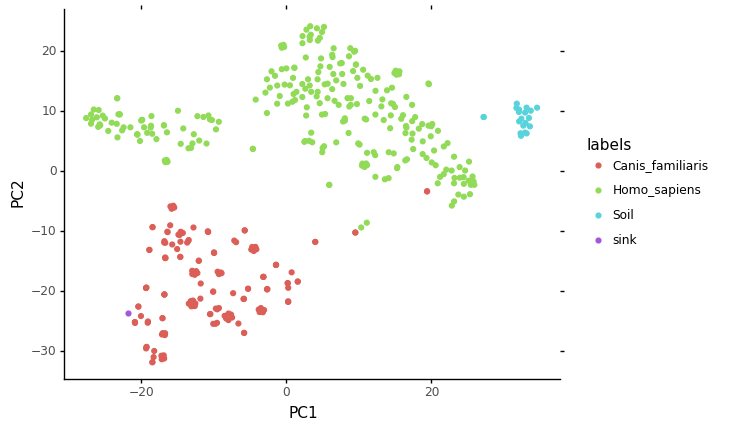

# Sourcepredict analysis example


```python
import pandas as pd
```

In this example, we'll apply Sourcepredict to the example data.   

The [example source files](https://github.com/maxibor/sourcepredict/blob/master/data/modern_gut_microbiomes_sources.csv) contains the following sources:
- *Homo sapiens* gut microbiome ([1](https://doi.org/10.1038/nature11234), [2](https://doi.org/10.1093/gigascience/giz004), [3](https://doi.org/10.1038/s41564-019-0409-6), [4](https://doi.org/10.1016/j.cell.2019.01.001), [5](https://doi.org/10.1038/ncomms7505), [6](http://doi.org/10.1016/j.cub.2015.04.055))
- *Canis familiaris* gut microbiome ([1](https://doi.org/10.1186/s40168-018-0450-3))
- Soil microbiome ([1](https://doi.org/10.1073/pnas.1215210110), [2](https://www.ncbi.nlm.nih.gov/bioproject/?term=322597), [3](https://dx.doi.org/10.1128%2FAEM.01646-17))


```python
src = pd.read_csv("../data/modern_gut_microbiomes_sources.csv", index_col=0)
labels = pd.read_csv("../data/modern_gut_microbiomes_labels.csv", index_col=0)
```

A source file is a OTU count table containing the samples as columns headers, and the TAXID as row indices


```python
src.head()
```


<div>
<style scoped>
    .dataframe tbody tr th:only-of-type {
        vertical-align: middle;
    }

    .dataframe tbody tr th {
        vertical-align: top;
    }

    .dataframe thead th {
        text-align: right;
    }
</style>
<table border="1" class="dataframe">
  <thead>
    <tr style="text-align: right;">
      <th></th>
      <th>SRR1175007</th>
      <th>SRR042182</th>
      <th>SRR061154</th>
      <th>SRR061499</th>
      <th>SRR063469</th>
      <th>SRR062324</th>
      <th>SRR1179037</th>
      <th>SRR061236</th>
      <th>SRR061456</th>
      <th>SRR642021</th>
      <th>...</th>
      <th>mgm4477903_3</th>
      <th>mgm4477807_3</th>
      <th>mgm4477874_3</th>
      <th>mgm4477904_3</th>
      <th>mgm4477804_3</th>
      <th>mgm4477873_3</th>
      <th>ERR1939166</th>
      <th>SRR3578625</th>
      <th>ERR1939165</th>
      <th>SRR3578645</th>
    </tr>
    <tr>
      <th>TAXID</th>
      <th></th>
      <th></th>
      <th></th>
      <th></th>
      <th></th>
      <th></th>
      <th></th>
      <th></th>
      <th></th>
      <th></th>
      <th></th>
      <th></th>
      <th></th>
      <th></th>
      <th></th>
      <th></th>
      <th></th>
      <th></th>
      <th></th>
      <th></th>
      <th></th>
    </tr>
  </thead>
  <tbody>
    <tr>
      <th>0</th>
      <td>3528337.0</td>
      <td>11563613.0</td>
      <td>10084261.0</td>
      <td>20054993.0</td>
      <td>8747525.0</td>
      <td>12116517.0</td>
      <td>4191329.0</td>
      <td>13992760.0</td>
      <td>14825759.0</td>
      <td>11083673.0</td>
      <td>...</td>
      <td>6169203.0</td>
      <td>8820851.0</td>
      <td>5713837.0</td>
      <td>10238500.0</td>
      <td>5055930.0</td>
      <td>10380594.0</td>
      <td>13391896.0</td>
      <td>1553.0</td>
      <td>14802198.0</td>
      <td>736.0</td>
    </tr>
    <tr>
      <th>6</th>
      <td>0.0</td>
      <td>78.0</td>
      <td>0.0</td>
      <td>127.0</td>
      <td>0.0</td>
      <td>79.0</td>
      <td>0.0</td>
      <td>0.0</td>
      <td>0.0</td>
      <td>172.0</td>
      <td>...</td>
      <td>68.0</td>
      <td>247.0</td>
      <td>211.0</td>
      <td>156.0</td>
      <td>147.0</td>
      <td>383.0</td>
      <td>1353.0</td>
      <td>0.0</td>
      <td>1522.0</td>
      <td>0.0</td>
    </tr>
    <tr>
      <th>7</th>
      <td>0.0</td>
      <td>78.0</td>
      <td>0.0</td>
      <td>127.0</td>
      <td>0.0</td>
      <td>79.0</td>
      <td>0.0</td>
      <td>0.0</td>
      <td>0.0</td>
      <td>172.0</td>
      <td>...</td>
      <td>68.0</td>
      <td>247.0</td>
      <td>211.0</td>
      <td>156.0</td>
      <td>147.0</td>
      <td>383.0</td>
      <td>1353.0</td>
      <td>0.0</td>
      <td>1522.0</td>
      <td>0.0</td>
    </tr>
    <tr>
      <th>9</th>
      <td>0.0</td>
      <td>129.0</td>
      <td>0.0</td>
      <td>153.0</td>
      <td>0.0</td>
      <td>151.0</td>
      <td>0.0</td>
      <td>165.0</td>
      <td>96.0</td>
      <td>0.0</td>
      <td>...</td>
      <td>0.0</td>
      <td>0.0</td>
      <td>0.0</td>
      <td>0.0</td>
      <td>0.0</td>
      <td>0.0</td>
      <td>77.0</td>
      <td>0.0</td>
      <td>65.0</td>
      <td>0.0</td>
    </tr>
    <tr>
      <th>10</th>
      <td>0.0</td>
      <td>160.0</td>
      <td>0.0</td>
      <td>193.0</td>
      <td>0.0</td>
      <td>99.0</td>
      <td>0.0</td>
      <td>55.0</td>
      <td>249.0</td>
      <td>238.0</td>
      <td>...</td>
      <td>0.0</td>
      <td>0.0</td>
      <td>0.0</td>
      <td>0.0</td>
      <td>0.0</td>
      <td>0.0</td>
      <td>263.0</td>
      <td>0.0</td>
      <td>466.0</td>
      <td>0.0</td>
    </tr>
  </tbody>
</table>
<p>5 rows × 432 columns</p>
</div>


The labels file contains the mapping of samples names with their actual sources


```python
labels.head()
```


<div>
<style scoped>
    .dataframe tbody tr th:only-of-type {
        vertical-align: middle;
    }

    .dataframe tbody tr th {
        vertical-align: top;
    }

    .dataframe thead th {
        text-align: right;
    }
</style>
<table border="1" class="dataframe">
  <thead>
    <tr style="text-align: right;">
      <th></th>
      <th>labels</th>
    </tr>
  </thead>
  <tbody>
    <tr>
      <th>SRR1175007</th>
      <td>Homo_sapiens</td>
    </tr>
    <tr>
      <th>SRR042182</th>
      <td>Homo_sapiens</td>
    </tr>
    <tr>
      <th>SRR061154</th>
      <td>Homo_sapiens</td>
    </tr>
    <tr>
      <th>SRR061499</th>
      <td>Homo_sapiens</td>
    </tr>
    <tr>
      <th>SRR063469</th>
      <td>Homo_sapiens</td>
    </tr>
  </tbody>
</table>
</div>


Here, we'll use a sink file coming for a [dog gut microbiome study](https://microbiomejournal.biomedcentral.com/articles/10.1186/s40168-018-0450-3).  
A sink file is formatted exactly like a source file, with samples as columns headers, and the TAXID as row indices.


```python
sink = pd.read_csv("../data/test/dog_test_sample.csv", index_col=0)
sink.head()
```


<div>
<style scoped>
    .dataframe tbody tr th:only-of-type {
        vertical-align: middle;
    }

    .dataframe tbody tr th {
        vertical-align: top;
    }

    .dataframe thead th {
        text-align: right;
    }
</style>
<table border="1" class="dataframe">
  <thead>
    <tr style="text-align: right;">
      <th></th>
      <th>ERR1915662</th>
    </tr>
    <tr>
      <th>TAXID</th>
      <th></th>
    </tr>
  </thead>
  <tbody>
    <tr>
      <th>0</th>
      <td>1933576</td>
    </tr>
    <tr>
      <th>838</th>
      <td>61161</td>
    </tr>
    <tr>
      <th>839</th>
      <td>10783</td>
    </tr>
    <tr>
      <th>28132</th>
      <td>6691</td>
    </tr>
    <tr>
      <th>28131</th>
      <td>5961</td>
    </tr>
  </tbody>
</table>
</div>


We'll now launch sourcepredict with the GMPR normalization method, and the t-SNE embedding, on 6 cores.


```python
!sourcepredict -s ../data/modern_gut_microbiomes_sources.csv \
               -l ../data/modern_gut_microbiomes_labels.csv \
               -n GMPR \
               -m TSNE \
               -e example_embedding.csv \
               -t 6 ../data/test/dog_test_sample.csv
```

    Step 1: Checking for unknown proportion
      == Sample: ERR1915662 ==
    	Adding unknown
    	Normalizing (GMPR)
    	Computing Bray-Curtis distance
    	Performing MDS embedding in 2 dimensions
    	KNN machine learning
    	Training KNN classifier on 6 cores...
    	-> Testing Accuracy: 1.0
    	----------------------
    	- Sample: ERR1915662
    		 known:98.61%
    		 unknown:1.39%
    Step 2: Checking for source proportion
    	Computing weighted_unifrac distance on species rank
    	TSNE embedding in 2 dimensions
    	KNN machine learning
    	Performing 5 fold cross validation on 6 cores...
    	Trained KNN classifier with 10 neighbors
    	-> Testing Accuracy: 0.99
    	----------------------
    	- Sample: ERR1915662
    		 Canis_familiaris:96.1%
    		 Homo_sapiens:2.47%
    		 Soil:1.43%
    Sourcepredict result written to dog_test_sample.sourcepredict.csv
    Embedding coordinates written to example_embedding.csv
    

Two files were generated by Sourcepredict:
- `dog_test_sample.sourcepredict.csv` which contains the proportions of each source  
We can see that as expected for a dog gut microbiome sample, it is mostly predicted as coming from a dog source (*Canis familiaris*)


```python
pd.read_csv("dog_test_sample.sourcepredict.csv", index_col=0)
```


<div>
<style scoped>
    .dataframe tbody tr th:only-of-type {
        vertical-align: middle;
    }

    .dataframe tbody tr th {
        vertical-align: top;
    }

    .dataframe thead th {
        text-align: right;
    }
</style>
<table border="1" class="dataframe">
  <thead>
    <tr style="text-align: right;">
      <th></th>
      <th>ERR1915662</th>
    </tr>
  </thead>
  <tbody>
    <tr>
      <th>Canis_familiaris</th>
      <td>0.947610</td>
    </tr>
    <tr>
      <th>Homo_sapiens</th>
      <td>0.024396</td>
    </tr>
    <tr>
      <th>Soil</th>
      <td>0.014106</td>
    </tr>
    <tr>
      <th>unknown</th>
      <td>0.013889</td>
    </tr>
  </tbody>
</table>
</div>


- `example_embedding.csv` which contains the embedding coordinates of all samples (sources and sinks)


```python
embed = pd.read_csv("example_embedding.csv", index_col=0)
embed.head()
```


<div>
<style scoped>
    .dataframe tbody tr th:only-of-type {
        vertical-align: middle;
    }

    .dataframe tbody tr th {
        vertical-align: top;
    }

    .dataframe thead th {
        text-align: right;
    }
</style>
<table border="1" class="dataframe">
  <thead>
    <tr style="text-align: right;">
      <th></th>
      <th>PC1</th>
      <th>PC2</th>
      <th>labels</th>
      <th>name</th>
    </tr>
  </thead>
  <tbody>
    <tr>
      <th>SRR1175007</th>
      <td>-25.936980</td>
      <td>7.392624</td>
      <td>Homo_sapiens</td>
      <td>SRR1175007</td>
    </tr>
    <tr>
      <th>SRR042182</th>
      <td>-19.180529</td>
      <td>6.396648</td>
      <td>Homo_sapiens</td>
      <td>SRR042182</td>
    </tr>
    <tr>
      <th>SRR061154</th>
      <td>-26.551731</td>
      <td>10.277035</td>
      <td>Homo_sapiens</td>
      <td>SRR061154</td>
    </tr>
    <tr>
      <th>SRR061499</th>
      <td>-22.634090</td>
      <td>6.809382</td>
      <td>Homo_sapiens</td>
      <td>SRR061499</td>
    </tr>
    <tr>
      <th>SRR063469</th>
      <td>-20.179138</td>
      <td>5.025330</td>
      <td>Homo_sapiens</td>
      <td>SRR063469</td>
    </tr>
  </tbody>
</table>
</div>


We can plot this embedding, using for example, [plotnine](https://plotnine.readthedocs.io/en/stable/), which implements the grammar of graphics in Python


```python
from plotnine import *
import warnings
warnings.filterwarnings('ignore')
```


```python
ggplot(data = embed, mapping = aes(x="PC1",y="PC2", color="labels")) + geom_point() + theme_classic()
```





    <ggplot: (-9223372036553722059)>


We can see that our Dog sink sample is well embedded with the other reference dog samples
