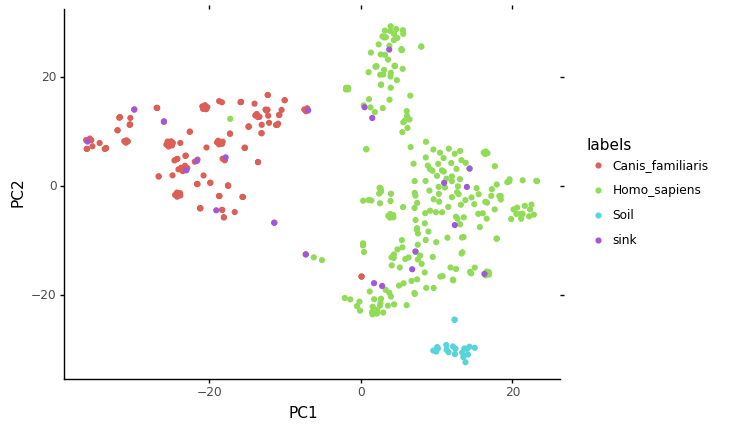

# Sourcepredict example 1: Gut host species prediction


```python
import pandas as pd
```

In this example, we'll apply Sourcepredict to the example dataset provided in the Sourcepredict directory.   

The [example datasets](https://github.com/maxibor/sourcepredict/blob/master/data/modern_gut_microbiomes_sources.csv) contains the following samples:
- *Homo sapiens* gut microbiome ([1](https://doi.org/10.1038/nature11234), [2](https://doi.org/10.1093/gigascience/giz004), [3](https://doi.org/10.1038/s41564-019-0409-6), [4](https://doi.org/10.1016/j.cell.2019.01.001), [5](https://doi.org/10.1038/ncomms7505), [6](http://doi.org/10.1016/j.cub.2015.04.055))
- *Canis familiaris* gut microbiome ([1](https://doi.org/10.1186/s40168-018-0450-3))
- Soil microbiome ([1](https://doi.org/10.1073/pnas.1215210110), [2](https://www.ncbi.nlm.nih.gov/bioproject/?term=322597), [3](https://dx.doi.org/10.1128%2FAEM.01646-17))

## Preparing the data


```python
otus = pd.read_csv("../data/modern_gut_microbiomes_sources.csv", index_col=0)
labels = pd.read_csv("../data/modern_gut_microbiomes_labels.csv", index_col=0)
```

This is a OTU count table containing the samples as columns headers, and the TAXID as row indices


```python
otus.head()
```


<div>
<style scoped>
    .dataframe tbody tr th:only-of-type {
        vertical-align: middle;
    }

    .dataframe tbody tr th {
        vertical-align: top;
    }

    .dataframe thead th {
        text-align: right;
    }
</style>
<table border="1" class="dataframe">
  <thead>
    <tr style="text-align: right;">
      <th></th>
      <th>SRR1175007</th>
      <th>SRR042182</th>
      <th>SRR061154</th>
      <th>SRR061499</th>
      <th>SRR063469</th>
      <th>SRR062324</th>
      <th>SRR1179037</th>
      <th>SRR061236</th>
      <th>SRR061456</th>
      <th>SRR642021</th>
      <th>...</th>
      <th>mgm4477903_3</th>
      <th>mgm4477807_3</th>
      <th>mgm4477874_3</th>
      <th>mgm4477904_3</th>
      <th>mgm4477804_3</th>
      <th>mgm4477873_3</th>
      <th>ERR1939166</th>
      <th>SRR3578625</th>
      <th>ERR1939165</th>
      <th>SRR3578645</th>
    </tr>
    <tr>
      <th>TAXID</th>
      <th></th>
      <th></th>
      <th></th>
      <th></th>
      <th></th>
      <th></th>
      <th></th>
      <th></th>
      <th></th>
      <th></th>
      <th></th>
      <th></th>
      <th></th>
      <th></th>
      <th></th>
      <th></th>
      <th></th>
      <th></th>
      <th></th>
      <th></th>
      <th></th>
    </tr>
  </thead>
  <tbody>
    <tr>
      <th>0</th>
      <td>3528337.0</td>
      <td>11563613.0</td>
      <td>10084261.0</td>
      <td>20054993.0</td>
      <td>8747525.0</td>
      <td>12116517.0</td>
      <td>4191329.0</td>
      <td>13992760.0</td>
      <td>14825759.0</td>
      <td>11083673.0</td>
      <td>...</td>
      <td>6169203.0</td>
      <td>8820851.0</td>
      <td>5713837.0</td>
      <td>10238500.0</td>
      <td>5055930.0</td>
      <td>10380594.0</td>
      <td>13391896.0</td>
      <td>1553.0</td>
      <td>14802198.0</td>
      <td>736.0</td>
    </tr>
    <tr>
      <th>6</th>
      <td>0.0</td>
      <td>78.0</td>
      <td>0.0</td>
      <td>127.0</td>
      <td>0.0</td>
      <td>79.0</td>
      <td>0.0</td>
      <td>0.0</td>
      <td>0.0</td>
      <td>172.0</td>
      <td>...</td>
      <td>68.0</td>
      <td>247.0</td>
      <td>211.0</td>
      <td>156.0</td>
      <td>147.0</td>
      <td>383.0</td>
      <td>1353.0</td>
      <td>0.0</td>
      <td>1522.0</td>
      <td>0.0</td>
    </tr>
    <tr>
      <th>7</th>
      <td>0.0</td>
      <td>78.0</td>
      <td>0.0</td>
      <td>127.0</td>
      <td>0.0</td>
      <td>79.0</td>
      <td>0.0</td>
      <td>0.0</td>
      <td>0.0</td>
      <td>172.0</td>
      <td>...</td>
      <td>68.0</td>
      <td>247.0</td>
      <td>211.0</td>
      <td>156.0</td>
      <td>147.0</td>
      <td>383.0</td>
      <td>1353.0</td>
      <td>0.0</td>
      <td>1522.0</td>
      <td>0.0</td>
    </tr>
    <tr>
      <th>9</th>
      <td>0.0</td>
      <td>129.0</td>
      <td>0.0</td>
      <td>153.0</td>
      <td>0.0</td>
      <td>151.0</td>
      <td>0.0</td>
      <td>165.0</td>
      <td>96.0</td>
      <td>0.0</td>
      <td>...</td>
      <td>0.0</td>
      <td>0.0</td>
      <td>0.0</td>
      <td>0.0</td>
      <td>0.0</td>
      <td>0.0</td>
      <td>77.0</td>
      <td>0.0</td>
      <td>65.0</td>
      <td>0.0</td>
    </tr>
    <tr>
      <th>10</th>
      <td>0.0</td>
      <td>160.0</td>
      <td>0.0</td>
      <td>193.0</td>
      <td>0.0</td>
      <td>99.0</td>
      <td>0.0</td>
      <td>55.0</td>
      <td>249.0</td>
      <td>238.0</td>
      <td>...</td>
      <td>0.0</td>
      <td>0.0</td>
      <td>0.0</td>
      <td>0.0</td>
      <td>0.0</td>
      <td>0.0</td>
      <td>263.0</td>
      <td>0.0</td>
      <td>466.0</td>
      <td>0.0</td>
    </tr>
  </tbody>
</table>
<p>5 rows × 432 columns</p>
</div>


The labels file contains the mapping of samples names with their actual origin (sources)


```python
labels.head()
```


<div>
<style scoped>
    .dataframe tbody tr th:only-of-type {
        vertical-align: middle;
    }

    .dataframe tbody tr th {
        vertical-align: top;
    }

    .dataframe thead th {
        text-align: right;
    }
</style>
<table border="1" class="dataframe">
  <thead>
    <tr style="text-align: right;">
      <th></th>
      <th>labels</th>
    </tr>
  </thead>
  <tbody>
    <tr>
      <th>SRR1175007</th>
      <td>Homo_sapiens</td>
    </tr>
    <tr>
      <th>SRR042182</th>
      <td>Homo_sapiens</td>
    </tr>
    <tr>
      <th>SRR061154</th>
      <td>Homo_sapiens</td>
    </tr>
    <tr>
      <th>SRR061499</th>
      <td>Homo_sapiens</td>
    </tr>
    <tr>
      <th>SRR063469</th>
      <td>Homo_sapiens</td>
    </tr>
  </tbody>
</table>
</div>


We will divide the source in training (95%) and testing (5%) dataset


```python
otus_train = otus.sample(frac=0.95, axis=1)
otus_test = otus.drop(otus_train.columns, axis=1)
```

We also have to subset the labels file to only the training dataset 


```python
train_labels = labels.loc[otus_train.columns,:]
test_labels = labels.loc[otus_test.columns,:]
```

## Sourcepredict

Last but not least, we must export the files to `csv` to run sourcepredict


```python
otus_train.to_csv("gut_species_sources.csv")
otus_test.to_csv("gut_species_sinks.csv")
train_labels.to_csv("gut_species_labels.csv")
```

We'll now launch sourcepredict with the GMPR normalization method, and the t-SNE embedding, on 6 cores.


```python
!sourcepredict -s gut_species_sources.csv \
               -l gut_species_labels.csv \
               -n GMPR \
               -m TSNE \
               -e example_embedding.csv \
               -t 6 gut_species_sinks.csv
```

    Step 1: Checking for unknown proportion
      == Sample: SRR061140 ==
    	Adding unknown
    	Normalizing (GMPR)
    	Computing Bray-Curtis distance
    	Performing MDS embedding in 2 dimensions
    	KNN machine learning
    	Training KNN classifier on 6 cores...
    	-> Testing Accuracy: 0.97
    	----------------------
    	- Sample: SRR061140
    		 known:89.68%
    		 unknown:10.32%
      == Sample: SRR1930179 ==
    	Adding unknown
    	Normalizing (GMPR)
    	Computing Bray-Curtis distance
    	Performing MDS embedding in 2 dimensions
    	KNN machine learning
    	Training KNN classifier on 6 cores...
    	-> Testing Accuracy: 1.0
    	----------------------
    	- Sample: SRR1930179
    		 known:98.48%
    		 unknown:1.52%
      == Sample: SRR1761714 ==
    	Adding unknown
    	Normalizing (GMPR)
    	Computing Bray-Curtis distance
    	Performing MDS embedding in 2 dimensions
    	KNN machine learning
    	Training KNN classifier on 6 cores...
    	-> Testing Accuracy: 0.99
    	----------------------
    	- Sample: SRR1761714
    		 known:98.81%
    		 unknown:1.19%
      == Sample: SRR1761669 ==
    	Adding unknown
    	Normalizing (GMPR)
    	Computing Bray-Curtis distance
    	Performing MDS embedding in 2 dimensions
    	KNN machine learning
    	Training KNN classifier on 6 cores...
    	-> Testing Accuracy: 1.0
    	----------------------
    	- Sample: SRR1761669
    		 known:98.48%
    		 unknown:1.52%
      == Sample: SRR1761671 ==
    	Adding unknown
    	Normalizing (GMPR)
    	Computing Bray-Curtis distance
    	Performing MDS embedding in 2 dimensions
    	KNN machine learning
    	Training KNN classifier on 6 cores...
    	-> Testing Accuracy: 1.0
    	----------------------
    	- Sample: SRR1761671
    		 known:98.49%
    		 unknown:1.51%
      == Sample: SRR7658636 ==
    	Adding unknown
    	Normalizing (GMPR)
    	Computing Bray-Curtis distance
    	Performing MDS embedding in 2 dimensions
    	KNN machine learning
    	Training KNN classifier on 6 cores...
    	-> Testing Accuracy: 0.99
    	----------------------
    	- Sample: SRR7658636
    		 known:98.49%
    		 unknown:1.51%
      == Sample: SRR7658609 ==
    	Adding unknown
    	Normalizing (GMPR)
    	Computing Bray-Curtis distance
    	Performing MDS embedding in 2 dimensions
    	KNN machine learning
    	Training KNN classifier on 6 cores...
    	-> Testing Accuracy: 1.0
    	----------------------
    	- Sample: SRR7658609
    		 known:98.48%
    		 unknown:1.52%
      == Sample: SRR7658624 ==
    	Adding unknown
    	Normalizing (GMPR)
    	Computing Bray-Curtis distance
    	Performing MDS embedding in 2 dimensions
    	KNN machine learning
    	Training KNN classifier on 6 cores...
    	-> Testing Accuracy: 0.96
    	----------------------
    	- Sample: SRR7658624
    		 known:98.76%
    		 unknown:1.24%
      == Sample: SRR7658682 ==
    	Adding unknown
    	Normalizing (GMPR)
    	Computing Bray-Curtis distance
    	Performing MDS embedding in 2 dimensions
    	KNN machine learning
    	Training KNN classifier on 6 cores...
    	-> Testing Accuracy: 0.99
    	----------------------
    	- Sample: SRR7658682
    		 known:98.48%
    		 unknown:1.52%
      == Sample: SRR2189052 ==
    	Adding unknown
    	Normalizing (GMPR)
    	Computing Bray-Curtis distance
    	Performing MDS embedding in 2 dimensions
    	KNN machine learning
    	Training KNN classifier on 6 cores...
    	-> Testing Accuracy: 1.0
    	----------------------
    	- Sample: SRR2189052
    		 known:98.48%
    		 unknown:1.52%
      == Sample: SRR2193437 ==
    	Adding unknown
    	Normalizing (GMPR)
    	Computing Bray-Curtis distance
    	Performing MDS embedding in 2 dimensions
    	KNN machine learning
    	Training KNN classifier on 6 cores...
    	-> Testing Accuracy: 1.0
    	----------------------
    	- Sample: SRR2193437
    		 known:98.48%
    		 unknown:1.52%
      == Sample: SRR5898924 ==
    	Adding unknown
    	Normalizing (GMPR)
    	Computing Bray-Curtis distance
    	Performing MDS embedding in 2 dimensions
    	KNN machine learning
    	Training KNN classifier on 6 cores...
    	-> Testing Accuracy: 1.0
    	----------------------
    	- Sample: SRR5898924
    		 known:98.48%
    		 unknown:1.52%
      == Sample: ERR2402780 ==
    	Adding unknown
    	Normalizing (GMPR)
    	Computing Bray-Curtis distance
    	Performing MDS embedding in 2 dimensions
    	KNN machine learning
    	Training KNN classifier on 6 cores...
    	-> Testing Accuracy: 1.0
    	----------------------
    	- Sample: ERR2402780
    		 known:92.71%
    		 unknown:7.29%
      == Sample: ERR1916139 ==
    	Adding unknown
    	Normalizing (GMPR)
    	Computing Bray-Curtis distance
    	Performing MDS embedding in 2 dimensions
    	KNN machine learning
    	Training KNN classifier on 6 cores...
    	-> Testing Accuracy: 1.0
    	----------------------
    	- Sample: ERR1916139
    		 known:98.48%
    		 unknown:1.52%
      == Sample: ERR1913614 ==
    	Adding unknown
    	Normalizing (GMPR)
    	Computing Bray-Curtis distance
    	Performing MDS embedding in 2 dimensions
    	KNN machine learning
    	Training KNN classifier on 6 cores...
    	-> Testing Accuracy: 1.0
    	----------------------
    	- Sample: ERR1913614
    		 known:98.48%
    		 unknown:1.52%
      == Sample: ERR1915757 ==
    	Adding unknown
    	Normalizing (GMPR)
    	Computing Bray-Curtis distance
    	Performing MDS embedding in 2 dimensions
    	KNN machine learning
    	Training KNN classifier on 6 cores...
    	-> Testing Accuracy: 1.0
    	----------------------
    	- Sample: ERR1915757
    		 known:98.48%
    		 unknown:1.52%
      == Sample: ERR1914185 ==
    	Adding unknown
    	Normalizing (GMPR)
    	Computing Bray-Curtis distance
    	Performing MDS embedding in 2 dimensions
    	KNN machine learning
    	Training KNN classifier on 6 cores...
    	-> Testing Accuracy: 1.0
    	----------------------
    	- Sample: ERR1914185
    		 known:98.48%
    		 unknown:1.52%
      == Sample: ERR1913950 ==
    	Adding unknown
    	Normalizing (GMPR)
    	Computing Bray-Curtis distance
    	Performing MDS embedding in 2 dimensions
    	KNN machine learning
    	Training KNN classifier on 6 cores...
    	-> Testing Accuracy: 1.0
    	----------------------
    	- Sample: ERR1913950
    		 known:98.48%
    		 unknown:1.52%
      == Sample: ERR1914208 ==
    	Adding unknown
    	Normalizing (GMPR)
    	Computing Bray-Curtis distance
    	Performing MDS embedding in 2 dimensions
    	KNN machine learning
    	Training KNN classifier on 6 cores...
    	-> Testing Accuracy: 1.0
    	----------------------
    	- Sample: ERR1914208
    		 known:98.48%
    		 unknown:1.52%
      == Sample: ERR1915100 ==
    	Adding unknown
    	Normalizing (GMPR)
    	Computing Bray-Curtis distance
    	Performing MDS embedding in 2 dimensions
    	KNN machine learning
    	Training KNN classifier on 6 cores...
    	-> Testing Accuracy: 1.0
    	----------------------
    	- Sample: ERR1915100
    		 known:98.48%
    		 unknown:1.52%
      == Sample: ERR1915204 ==
    	Adding unknown
    	Normalizing (GMPR)
    	Computing Bray-Curtis distance
    	Performing MDS embedding in 2 dimensions
    	KNN machine learning
    	Training KNN classifier on 6 cores...
    	-> Testing Accuracy: 1.0
    	----------------------
    	- Sample: ERR1915204
    		 known:98.48%
    		 unknown:1.52%
      == Sample: ERR1913542 ==
    	Adding unknown
    	Normalizing (GMPR)
    	Computing Bray-Curtis distance
    	Performing MDS embedding in 2 dimensions
    	KNN machine learning
    	Training KNN classifier on 6 cores...
    	-> Testing Accuracy: 1.0
    	----------------------
    	- Sample: ERR1913542
    		 known:98.48%
    		 unknown:1.52%
    Step 2: Checking for source proportion
    	Computing weighted_unifrac distance on species rank
    	TSNE embedding in 2 dimensions
    	KNN machine learning
    	Performing 5 fold cross validation on 6 cores...
    	Trained KNN classifier with 10 neighbors
    	-> Testing Accuracy: 1.0
    	----------------------
    	- Sample: SRR061140
    		 Canis_familiaris:1.91%
    		 Homo_sapiens:96.57%
    		 Soil:1.52%
    	- Sample: SRR1930179
    		 Canis_familiaris:1.91%
    		 Homo_sapiens:96.57%
    		 Soil:1.52%
    	- Sample: SRR1761714
    		 Canis_familiaris:1.91%
    		 Homo_sapiens:96.57%
    		 Soil:1.52%
    	- Sample: SRR1761669
    		 Canis_familiaris:1.91%
    		 Homo_sapiens:96.57%
    		 Soil:1.52%
    	- Sample: SRR1761671
    		 Canis_familiaris:1.91%
    		 Homo_sapiens:96.57%
    		 Soil:1.52%
    	- Sample: SRR7658636
    		 Canis_familiaris:1.91%
    		 Homo_sapiens:96.57%
    		 Soil:1.52%
    	- Sample: SRR7658609
    		 Canis_familiaris:1.91%
    		 Homo_sapiens:96.57%
    		 Soil:1.52%
    	- Sample: SRR7658624
    		 Canis_familiaris:6.11%
    		 Homo_sapiens:92.37%
    		 Soil:1.52%
    	- Sample: SRR7658682
    		 Canis_familiaris:11.25%
    		 Homo_sapiens:87.23%
    		 Soil:1.53%
    	- Sample: SRR2189052
    		 Canis_familiaris:1.91%
    		 Homo_sapiens:96.57%
    		 Soil:1.52%
    	- Sample: SRR2193437
    		 Canis_familiaris:1.91%
    		 Homo_sapiens:96.57%
    		 Soil:1.52%
    	- Sample: SRR5898924
    		 Canis_familiaris:1.91%
    		 Homo_sapiens:96.57%
    		 Soil:1.52%
    	- Sample: ERR2402780
    		 Canis_familiaris:94.02%
    		 Homo_sapiens:4.46%
    		 Soil:1.53%
    	- Sample: ERR1916139
    		 Canis_familiaris:94.02%
    		 Homo_sapiens:4.46%
    		 Soil:1.53%
    	- Sample: ERR1913614
    		 Canis_familiaris:94.02%
    		 Homo_sapiens:4.46%
    		 Soil:1.53%
    	- Sample: ERR1915757
    		 Canis_familiaris:94.02%
    		 Homo_sapiens:4.46%
    		 Soil:1.53%
    	- Sample: ERR1914185
    		 Canis_familiaris:94.02%
    		 Homo_sapiens:4.46%
    		 Soil:1.53%
    	- Sample: ERR1913950
    		 Canis_familiaris:94.02%
    		 Homo_sapiens:4.46%
    		 Soil:1.53%
    	- Sample: ERR1914208
    		 Canis_familiaris:94.02%
    		 Homo_sapiens:4.46%
    		 Soil:1.53%
    	- Sample: ERR1915100
    		 Canis_familiaris:94.02%
    		 Homo_sapiens:4.46%
    		 Soil:1.53%
    	- Sample: ERR1915204
    		 Canis_familiaris:93.99%
    		 Homo_sapiens:4.49%
    		 Soil:1.53%
    	- Sample: ERR1913542
    		 Canis_familiaris:94.02%
    		 Homo_sapiens:4.46%
    		 Soil:1.53%
    Sourcepredict result written to gut_species_sinks.sourcepredict.csv
    Embedding coordinates written to example_embedding.csv
    

Two files were generated by Sourcepredict:
- `gut_species_sinks.sourcepredict.csv` which contains the proportions of each source  


```python
sourcepred = pd.read_csv("gut_species_sinks.sourcepredict.csv", index_col=0)
```


```python
sourcepred
```


<div>
<style scoped>
    .dataframe tbody tr th:only-of-type {
        vertical-align: middle;
    }

    .dataframe tbody tr th {
        vertical-align: top;
    }

    .dataframe thead th {
        text-align: right;
    }
</style>
<table border="1" class="dataframe">
  <thead>
    <tr style="text-align: right;">
      <th></th>
      <th>SRR061140</th>
      <th>SRR1930179</th>
      <th>SRR1761714</th>
      <th>SRR1761669</th>
      <th>SRR1761671</th>
      <th>SRR7658636</th>
      <th>SRR7658609</th>
      <th>SRR7658624</th>
      <th>SRR7658682</th>
      <th>SRR2189052</th>
      <th>...</th>
      <th>ERR2402780</th>
      <th>ERR1916139</th>
      <th>ERR1913614</th>
      <th>ERR1915757</th>
      <th>ERR1914185</th>
      <th>ERR1913950</th>
      <th>ERR1914208</th>
      <th>ERR1915100</th>
      <th>ERR1915204</th>
      <th>ERR1913542</th>
    </tr>
  </thead>
  <tbody>
    <tr>
      <th>Canis_familiaris</th>
      <td>0.017116</td>
      <td>0.018797</td>
      <td>0.018858</td>
      <td>0.018797</td>
      <td>0.018797</td>
      <td>0.018797</td>
      <td>0.018797</td>
      <td>0.060367</td>
      <td>0.110755</td>
      <td>0.018797</td>
      <td>...</td>
      <td>0.871639</td>
      <td>0.925936</td>
      <td>0.925936</td>
      <td>0.925936</td>
      <td>0.925936</td>
      <td>0.925936</td>
      <td>0.925936</td>
      <td>0.925936</td>
      <td>0.925646</td>
      <td>0.925936</td>
    </tr>
    <tr>
      <th>Homo_sapiens</th>
      <td>0.866062</td>
      <td>0.951112</td>
      <td>0.954214</td>
      <td>0.951112</td>
      <td>0.951134</td>
      <td>0.951131</td>
      <td>0.951112</td>
      <td>0.912196</td>
      <td>0.859040</td>
      <td>0.951112</td>
      <td>...</td>
      <td>0.041329</td>
      <td>0.043886</td>
      <td>0.043886</td>
      <td>0.043886</td>
      <td>0.043886</td>
      <td>0.043886</td>
      <td>0.043886</td>
      <td>0.043886</td>
      <td>0.044175</td>
      <td>0.043886</td>
    </tr>
    <tr>
      <th>Soil</th>
      <td>0.013603</td>
      <td>0.014939</td>
      <td>0.014988</td>
      <td>0.014939</td>
      <td>0.014940</td>
      <td>0.014939</td>
      <td>0.014939</td>
      <td>0.015031</td>
      <td>0.015053</td>
      <td>0.014939</td>
      <td>...</td>
      <td>0.014145</td>
      <td>0.015026</td>
      <td>0.015026</td>
      <td>0.015026</td>
      <td>0.015026</td>
      <td>0.015026</td>
      <td>0.015026</td>
      <td>0.015026</td>
      <td>0.015027</td>
      <td>0.015026</td>
    </tr>
    <tr>
      <th>unknown</th>
      <td>0.103218</td>
      <td>0.015152</td>
      <td>0.011940</td>
      <td>0.015152</td>
      <td>0.015129</td>
      <td>0.015133</td>
      <td>0.015152</td>
      <td>0.012405</td>
      <td>0.015152</td>
      <td>0.015152</td>
      <td>...</td>
      <td>0.072886</td>
      <td>0.015152</td>
      <td>0.015152</td>
      <td>0.015152</td>
      <td>0.015152</td>
      <td>0.015152</td>
      <td>0.015152</td>
      <td>0.015152</td>
      <td>0.015152</td>
      <td>0.015152</td>
    </tr>
  </tbody>
</table>
<p>4 rows × 22 columns</p>
</div>


Let's check which organism was predicted for each samples, and compare it with the true source


```python
comparison = sourcepred.idxmax().to_frame(name="prediction").merge(test_labels, left_index=True, right_index=True)
comparison.head()
```


<div>
<style scoped>
    .dataframe tbody tr th:only-of-type {
        vertical-align: middle;
    }

    .dataframe tbody tr th {
        vertical-align: top;
    }

    .dataframe thead th {
        text-align: right;
    }
</style>
<table border="1" class="dataframe">
  <thead>
    <tr style="text-align: right;">
      <th></th>
      <th>prediction</th>
      <th>labels</th>
    </tr>
  </thead>
  <tbody>
    <tr>
      <th>SRR061140</th>
      <td>Homo_sapiens</td>
      <td>Homo_sapiens</td>
    </tr>
    <tr>
      <th>SRR1930179</th>
      <td>Homo_sapiens</td>
      <td>Homo_sapiens</td>
    </tr>
    <tr>
      <th>SRR1761714</th>
      <td>Homo_sapiens</td>
      <td>Homo_sapiens</td>
    </tr>
    <tr>
      <th>SRR1761669</th>
      <td>Homo_sapiens</td>
      <td>Homo_sapiens</td>
    </tr>
    <tr>
      <th>SRR1761671</th>
      <td>Homo_sapiens</td>
      <td>Homo_sapiens</td>
    </tr>
  </tbody>
</table>
</div>


Finally, let's compute the accuracy


```python
(comparison["prediction"] == comparison["labels"]).sum()/comparison.shape[0]
```


    1.0


All the sinks samples were correctly predicted ! 

- The second file generated by sourcepredict is `example_embedding.csv` which contains the embedding coordinates of all samples (sources and sinks)


```python
embed = pd.read_csv("example_embedding.csv", index_col=0)
embed.head()
```


<div>
<style scoped>
    .dataframe tbody tr th:only-of-type {
        vertical-align: middle;
    }

    .dataframe tbody tr th {
        vertical-align: top;
    }

    .dataframe thead th {
        text-align: right;
    }
</style>
<table border="1" class="dataframe">
  <thead>
    <tr style="text-align: right;">
      <th></th>
      <th>PC1</th>
      <th>PC2</th>
      <th>labels</th>
      <th>name</th>
    </tr>
  </thead>
  <tbody>
    <tr>
      <th>SRR7658617</th>
      <td>5.048055</td>
      <td>-18.337936</td>
      <td>Homo_sapiens</td>
      <td>SRR7658617</td>
    </tr>
    <tr>
      <th>ERR1916180</th>
      <td>-24.480751</td>
      <td>-1.701613</td>
      <td>Canis_familiaris</td>
      <td>ERR1916180</td>
    </tr>
    <tr>
      <th>ERR1914445</th>
      <td>-25.628300</td>
      <td>7.534146</td>
      <td>Canis_familiaris</td>
      <td>ERR1914445</td>
    </tr>
    <tr>
      <th>SRR5898947</th>
      <td>-2.104542</td>
      <td>-20.617863</td>
      <td>Homo_sapiens</td>
      <td>SRR5898947</td>
    </tr>
    <tr>
      <th>SRR346691</th>
      <td>1.332757</td>
      <td>24.435493</td>
      <td>Homo_sapiens</td>
      <td>SRR346691</td>
    </tr>
  </tbody>
</table>
</div>


We can plot this embedding, using for example, [plotnine](https://plotnine.readthedocs.io/en/stable/), which implements the grammar of graphics in Python


```python
from plotnine import *
import warnings
warnings.filterwarnings('ignore')
```


```python
ggplot(data = embed, mapping = aes(x="PC1",y="PC2", color="labels")) + geom_point() + theme_classic()
```





    <ggplot: (7554096346)>


We can see on this plot where the sink samples were embedded

## Sourcetracker2

"[SourceTracker](https://www.ncbi.nlm.nih.gov/pubmed/21765408) is designed to predict the source of microbial communities in a set of input samples" and is generally consired as the gold standard method to do so.
The version 2 is a rewrite of the original Sourcetracker in Python.

We'll reuse the same training and test files, but we need to reformat them a bit for sourcetracker:
- In sourcetracker, the source (training) and sink (file) OTUs count table is a single file
- The metadata file is slightly different


```python
otus.to_csv("gut_species_otus.csv", sep="\t", index_label="TAXID")
```


```python
test_labels['SourceSink'] = ['sink']*test_labels.shape[0]
```


```python
train_labels['SourceSink'] = ['source']*train_labels.shape[0]
```


```python
metadata = train_labels.append(test_labels).rename(columns = {"labels":"Env"})[['SourceSink','Env']]
metadata.head()
```


<div>
<style scoped>
    .dataframe tbody tr th:only-of-type {
        vertical-align: middle;
    }

    .dataframe tbody tr th {
        vertical-align: top;
    }

    .dataframe thead th {
        text-align: right;
    }
</style>
<table border="1" class="dataframe">
  <thead>
    <tr style="text-align: right;">
      <th></th>
      <th>SourceSink</th>
      <th>Env</th>
    </tr>
  </thead>
  <tbody>
    <tr>
      <th>SRR7658617</th>
      <td>source</td>
      <td>Homo_sapiens</td>
    </tr>
    <tr>
      <th>ERR1916180</th>
      <td>source</td>
      <td>Canis_familiaris</td>
    </tr>
    <tr>
      <th>ERR1914445</th>
      <td>source</td>
      <td>Canis_familiaris</td>
    </tr>
    <tr>
      <th>SRR5898947</th>
      <td>source</td>
      <td>Homo_sapiens</td>
    </tr>
    <tr>
      <th>SRR346691</th>
      <td>source</td>
      <td>Homo_sapiens</td>
    </tr>
  </tbody>
</table>
</div>


```python
metadata.to_csv("st_gut_species_metadata.csv", sep="\t", index_label='#SampleID')
```

Finally, we need to convert the OTUs count table to biom format


```python
!biom convert -i gut_species_otus.csv -o gut_species_otus.biom --table-type="Taxon table" --to-json
```

Soucetracker launch command: `sourcetracker2 gibbs -i gut_species_otus.biom -m st_gut_species_metadata.csv -o gut_species --jobs 6`  
(Sourcetracker2 was run on a Linux remote server because of issues running it on MacOS)


```python
st_pred = pd.read_csv("gut_species/mixing_proportions.txt", sep = "\t", index_col=0)
st_pred.head()
```


<div>
<style scoped>
    .dataframe tbody tr th:only-of-type {
        vertical-align: middle;
    }

    .dataframe tbody tr th {
        vertical-align: top;
    }

    .dataframe thead th {
        text-align: right;
    }
</style>
<table border="1" class="dataframe">
  <thead>
    <tr style="text-align: right;">
      <th></th>
      <th>Canis_familiaris</th>
      <th>Homo_sapiens</th>
      <th>Soil</th>
      <th>Unknown</th>
    </tr>
    <tr>
      <th>#SampleID</th>
      <th></th>
      <th></th>
      <th></th>
      <th></th>
    </tr>
  </thead>
  <tbody>
    <tr>
      <th>SRR061140</th>
      <td>0.0883</td>
      <td>0.8581</td>
      <td>0.0127</td>
      <td>0.0409</td>
    </tr>
    <tr>
      <th>SRR1930179</th>
      <td>0.1694</td>
      <td>0.3526</td>
      <td>0.4425</td>
      <td>0.0355</td>
    </tr>
    <tr>
      <th>SRR1761714</th>
      <td>0.1836</td>
      <td>0.3525</td>
      <td>0.4371</td>
      <td>0.0268</td>
    </tr>
    <tr>
      <th>SRR1761669</th>
      <td>0.1180</td>
      <td>0.2142</td>
      <td>0.6087</td>
      <td>0.0591</td>
    </tr>
    <tr>
      <th>SRR1761671</th>
      <td>0.2159</td>
      <td>0.5738</td>
      <td>0.1725</td>
      <td>0.0378</td>
    </tr>
  </tbody>
</table>
</div>


```python
st_comparison = st_pred.idxmax(axis=1).to_frame(name="prediction")
st_comparison.head()
```


<div>
<style scoped>
    .dataframe tbody tr th:only-of-type {
        vertical-align: middle;
    }

    .dataframe tbody tr th {
        vertical-align: top;
    }

    .dataframe thead th {
        text-align: right;
    }
</style>
<table border="1" class="dataframe">
  <thead>
    <tr style="text-align: right;">
      <th></th>
      <th>prediction</th>
    </tr>
    <tr>
      <th>#SampleID</th>
      <th></th>
    </tr>
  </thead>
  <tbody>
    <tr>
      <th>SRR061140</th>
      <td>Homo_sapiens</td>
    </tr>
    <tr>
      <th>SRR1930179</th>
      <td>Soil</td>
    </tr>
    <tr>
      <th>SRR1761714</th>
      <td>Soil</td>
    </tr>
    <tr>
      <th>SRR1761669</th>
      <td>Soil</td>
    </tr>
    <tr>
      <th>SRR1761671</th>
      <td>Homo_sapiens</td>
    </tr>
  </tbody>
</table>
</div>


Let's compare the SourceTracker prediction with the true source


```python
comparison2 = st_comparison.merge(test_labels, left_index=True, right_index=True)
comparison2.head()
```


<div>
<style scoped>
    .dataframe tbody tr th:only-of-type {
        vertical-align: middle;
    }

    .dataframe tbody tr th {
        vertical-align: top;
    }

    .dataframe thead th {
        text-align: right;
    }
</style>
<table border="1" class="dataframe">
  <thead>
    <tr style="text-align: right;">
      <th></th>
      <th>prediction</th>
      <th>labels</th>
      <th>SourceSink</th>
    </tr>
  </thead>
  <tbody>
    <tr>
      <th>SRR061140</th>
      <td>Homo_sapiens</td>
      <td>Homo_sapiens</td>
      <td>sink</td>
    </tr>
    <tr>
      <th>SRR1930179</th>
      <td>Soil</td>
      <td>Homo_sapiens</td>
      <td>sink</td>
    </tr>
    <tr>
      <th>SRR1761714</th>
      <td>Soil</td>
      <td>Homo_sapiens</td>
      <td>sink</td>
    </tr>
    <tr>
      <th>SRR1761669</th>
      <td>Soil</td>
      <td>Homo_sapiens</td>
      <td>sink</td>
    </tr>
    <tr>
      <th>SRR1761671</th>
      <td>Homo_sapiens</td>
      <td>Homo_sapiens</td>
      <td>sink</td>
    </tr>
  </tbody>
</table>
</div>


Computing the accuracy


```python
(comparison2["prediction"] == comparison2["labels"]).sum()/comparison.shape[0]
```


    0.7727272727272727


Here, Sourcetracker only managed to predict 77% of the sink samples origin correctly

## Conclusion
On this dataset, we've seen that Sourcepredict can outperform Sourcetracker on predicting accurately the source species
